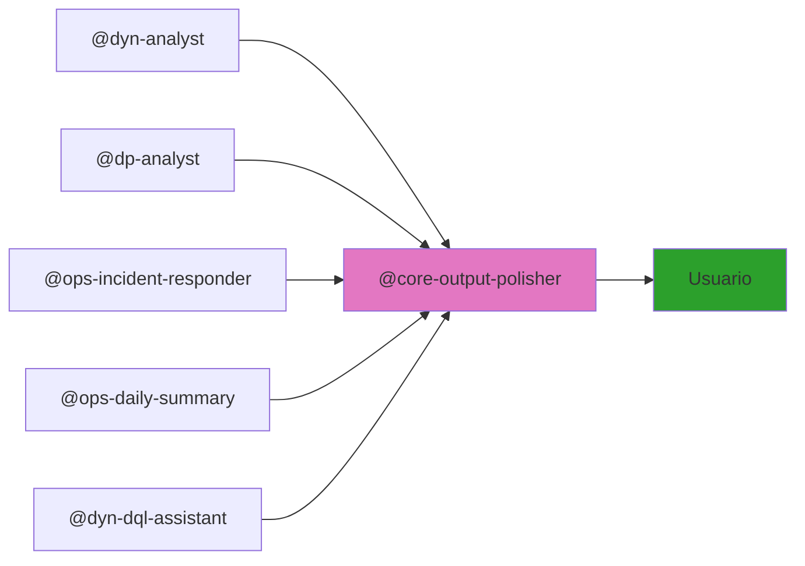

# GitHub Copilot Structure

Esta carpeta contiene la estructura de agentes, skills, prompts e instrucciones para la plataforma de inteligencia de Dynatrace y DataPower.

## Carpetas Oficiales de Copilot

- **`agents/`** - Agentes independientes organizados por dominio (todos como `.agent.md`)

  - **`dyn/`** — `dyn-analyst.agent.md`, `dyn-dql-assistant.agent.md`
  - **`dp/`** — `dp-analyst.agent.md`
  - **`ops/`** — `ops-incident-responder.agent.md`, `ops-daily-summary.agent.md`
  - **`core/`** — `core-structure-monitor.agent.md`, `core-output-polisher.agent.md`, `core-ai-team-dev.agent.md`, `core-atlassian-jira.agent.md`

- **`skills/`** - Conocimiento técnico reutilizable por los agentes (todos como `.md`)

  - **`dyn/`** — `dyn-queries.md`
  - **`dp/`** — `dp-analysis.md`
  - **`ops/`** — `ops-incident.md`, `ops-report-templates.md`, `ops-metrics-thresholds.md`
  - **`core/`** — `core-structure-monitor.md`, `core-output-polisher.md`, `core-gh-cli.md`, `core-auto-sync.md`, `core-naming-conventions.md`

- **`prompts/`** - Instrucciones de rol y comportamiento para cada agente

  - **`dyn/`** — `dyn-chatbot.prompt.md` - Rol, casos de uso y formato de respuesta
  - **`dp/`** — `dp-analyst.prompt.md` - Rol, severidad y escalamiento
  - **`core/`** — `core-structure-monitor.prompt.md` - Detección automática de cambios

- **`instructions/`** - Reglas auto-inyectadas por Copilot según el tipo de archivo

  - `core-naming-conventions.instructions.md` - Prefijos de dominio y commits (aplica a `**`)
  - `core-markdown-style.instructions.md` - Formato Markdown (aplica a `**/*.md`)

## Flujo de Output con Output Polisher

Todos los agentes pasan su salida por `@core-output-polisher` antes de entregarla al usuario:

## Cómo Funciona Structure Monitor

El agente `structure-monitor` funciona automáticamente:

1. **Detecta** cambios en carpetas, archivos o lógica
2. **Identifica** qué README.md necesitan actualizarse
3. **Regenera** diagramas Mermaid
4. **Corrige** formato Markdown (encabezados, tablas, bloques de código)
5. **Sincroniza** referencias cruzadas
6. **Valida** consistencia de documentación
7. **Hace commit y push** automáticamente

**No requiere activación manual** — trabaja transparentemente en segundo plano.

Para ejecutarlo manualmente: *"Sincroniza la documentación con los cambios actuales"*
