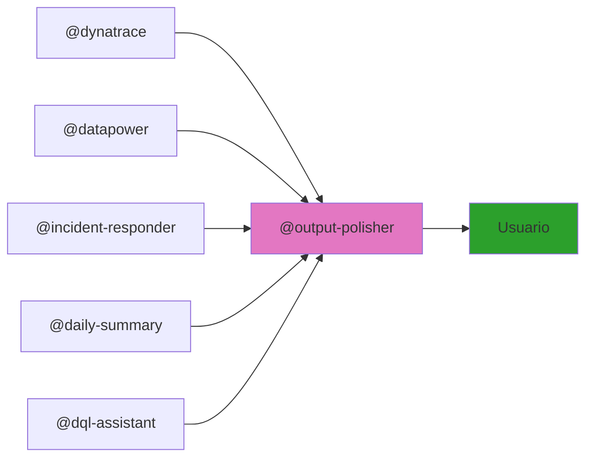

# GitHub Copilot Structure

Esta carpeta contiene la estructura de agentes, skills, prompts y herramientas para la plataforma de inteligencia de Dynatrace y DataPower.

## Carpetas Principales

- **`agents/`** - Agentes independientes por dominio

  - `dynatrace/` - Análisis DQL, métricas y anomalías con Davis AI
  - `datapower/` - Análisis profesional de reportes de gateway
  - `structure-monitor/` - Sincronización automática de documentación
  - `incident-responder/` - Respuesta a incidentes críticos (correlación Dynatrace + DataPower)
  - `daily-summary/` - Resumen diario automático de métricas
  - `dql-assistant/` - Construcción y validación de queries DQL
  - `output-polisher/` - Mejora léxica y gramatical de salidas
  - `ai-team-dev.agent.md` - Equipo de desarrollo (Nova/Sage/Milo)
  - `atlassian-requirements-to-jira.agent.md` - Transformación de requerimientos a Jira

- **`skills/`** - Conocimiento técnico reutilizable por los agentes

  - `dynatrace/` - Configuración API, biblioteca de queries DQL, sintaxis
  - `datapower/` - Estructura de reportes, patrones de análisis, códigos de error
  - `structure-monitor/` - Lógica de detección y sincronización
  - `incident-responder/` - Pasos de correlación y remediación por patrón
  - `output-polisher/` - 7 categorías de patrones de mejora en español
  - `gh-cli.md` - Referencia completa de GitHub CLI

- **`prompts/`** - Instrucciones de rol y comportamiento para cada agente

  - `dynatrace-chatbot.prompt.md` - Rol, casos de uso y formato de respuesta
  - `datapower-analyst.prompt.md` - Rol, severidad y escalamiento
  - `structure-monitor.prompt.md` - Detección automática de cambios

- **`customizations/`** - Configuración y convenciones del proyecto

  - `auto-sync.md` - Configuración de sincronización automática de documentación
  - `naming-conventions.md` - Convenciones de nombres, commits y reglas de formato Markdown

- **`toolboxes/`** - Recursos compartidos por múltiples agentes

  - `report-templates.md` - 4 plantillas estándar: incidente, ejecutivo, tendencias, alerta
  - `common-metrics.md` - SLO/SLA, umbrales de alerta y glosario Dynatrace/DataPower

## Flujo de Output con Output Polisher

Todos los agentes pasan su salida por `@output-polisher` antes de entregarla al usuario:

## Cómo Funciona Structure Monitor

El agente `structure-monitor` funciona automáticamente:

1. **Detecta** cambios en carpetas, archivos o lógica
2. **Identifica** qué README.md necesitan actualizarse
3. **Regenera** diagramas Mermaid
4. **Corrige** formato Markdown (encabezados, tablas, bloques de código)
5. **Sincroniza** referencias cruzadas
6. **Valida** consistencia de documentación
7. **Hace commit y push** automáticamente

**No requiere activación manual** — trabaja transparentemente en segundo plano.

Para ejecutarlo manualmente: *"Sincroniza la documentación con los cambios actuales"*
