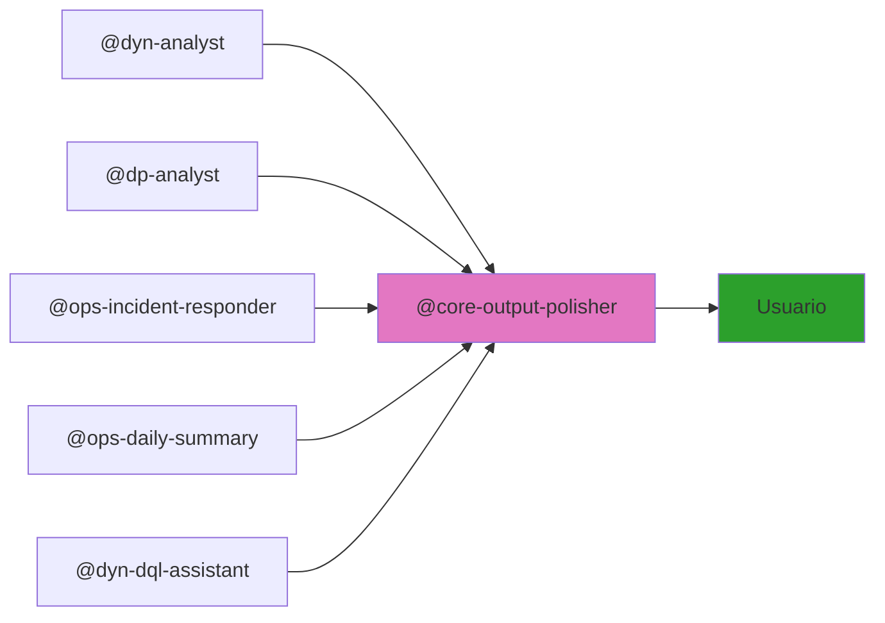

# GitHub Copilot Structure

Esta carpeta contiene la estructura de agentes, skills, prompts e instrucciones para la plataforma de inteligencia de Dynatrace y DataPower.

## Carpetas Oficiales de Copilot

- **`agents/`** - Agentes independientes organizados por dominio

  - **`dyn/`** — Dynatrace
    - `dyn-analyst/` - Análisis DQL, métricas y anomalías con Davis AI
    - `dyn-dql-assistant/` - Constructor y validador de queries DQL
  - **`dp/`** — DataPower
    - `dp-analyst/` - Análisis profesional de reportes de gateway
  - **`ops/`** — Operaciones (cross-domain)
    - `ops-incident-responder/` - Respuesta a incidentes (correlaciona dyn + dp)
    - `ops-daily-summary/` - Resumen diario automático de métricas
  - **`core/`** — Infraestructura transversal
    - `core-structure-monitor/` - Sincronización automática de documentación
    - `core-output-polisher/` - Mejora léxica y gramatical de salidas
    - `core-ai-team-dev.agent.md` - Equipo de desarrollo (Nova/Sage/Milo)
    - `core-atlassian-jira.agent.md` - Transformación de requerimientos a Jira

- **`skills/`** - Conocimiento técnico reutilizable por los agentes

  - **`dyn/`** — Dynatrace
    - `dyn-queries/` - Configuración API, biblioteca de queries DQL, sintaxis
  - **`dp/`** — DataPower
    - `dp-analysis/` - Estructura de reportes, patrones de análisis, códigos de error
  - **`ops/`** — Operaciones
    - `ops-incident/` - Pasos de correlación y remediación por patrón
    - `ops-report-templates.md` - 4 plantillas estándar: incidente, ejecutivo, tendencias, alerta
    - `ops-metrics-thresholds.md` - SLO/SLA, umbrales de alerta y glosario
  - **`core/`** — Infraestructura
    - `core-structure-monitor/` - Lógica de detección y sincronización
    - `core-output-polisher/` - 7 categorías de patrones de mejora en español
    - `core-gh-cli.md` - Referencia completa de GitHub CLI
    - `core-auto-sync.md` - Configuración de sincronización automática
    - `core-naming-conventions.md` - Convenciones de nombres, commits y formato Markdown

- **`prompts/`** - Instrucciones de rol y comportamiento para cada agente

  - **`dyn/`** — `dyn-chatbot.prompt.md` - Rol, casos de uso y formato de respuesta
  - **`dp/`** — `dp-analyst.prompt.md` - Rol, severidad y escalamiento
  - **`core/`** — `core-structure-monitor.prompt.md` - Detección automática de cambios

- **`instructions/`** - Reglas auto-inyectadas por Copilot según el tipo de archivo

  - `core-naming-conventions.instructions.md` - Prefijos de dominio y commits (aplica a `**`)
  - `core-markdown-style.instructions.md` - Formato Markdown (aplica a `**/*.md`)

## Flujo de Output con Output Polisher

Todos los agentes pasan su salida por `@core-output-polisher` antes de entregarla al usuario:

## Cómo Funciona Structure Monitor

El agente `structure-monitor` funciona automáticamente:

1. **Detecta** cambios en carpetas, archivos o lógica
2. **Identifica** qué README.md necesitan actualizarse
3. **Regenera** diagramas Mermaid
4. **Corrige** formato Markdown (encabezados, tablas, bloques de código)
5. **Sincroniza** referencias cruzadas
6. **Valida** consistencia de documentación
7. **Hace commit y push** automáticamente

**No requiere activación manual** — trabaja transparentemente en segundo plano.

Para ejecutarlo manualmente: *"Sincroniza la documentación con los cambios actuales"*
