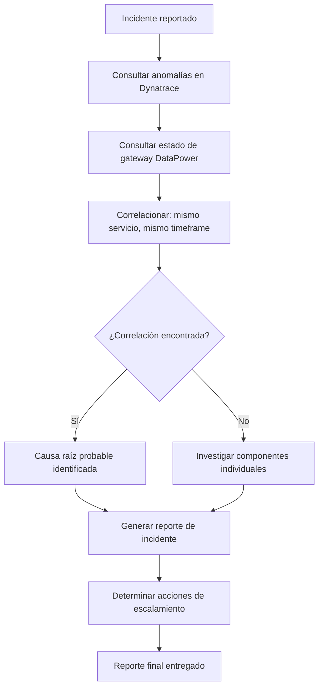

# Incident Responder Agent

Agente de respuesta a incidentes. Se activa cuando se detecta una anomalía crítica y genera un reporte de impacto correlacionando datos de Dynatrace y DataPower.

---

## Propósito

Automatizar la primera respuesta a incidentes críticos:

- Correlacionar anomalías de Dynatrace con estado de gateways DataPower
- Clasificar el impacto y severidad del incidente
- Generar el reporte de incidente usando la plantilla estándar
- Sugerir acciones de remediación basadas en patrones conocidos

---

## Cuándo Activar

- Davis AI detecta un problema con severidad PERFORMANCE o AVAILABILITY
- El agente DataPower reporta error rate > 5% en un servicio
- El agente Dynatrace detecta latencia P95 > 2000ms
- El usuario reporta un incidente manualmente

**Comando de activación:**

```dql
@ops-incident-responder El servicio {nombre} presenta {síntoma}
```

---

## Input Requerido

| Campo | Descripción | Ejemplo |
| ------- | ------------- | --------- |
| `servicio` | Nombre del servicio afectado | `payment-service` |
| `síntoma` | Descripción del problema observado | `alta latencia y errores 500` |
| `timeframe` | Ventana de tiempo a analizar | `última hora` (opcional, default: 1h) |

---

## Proceso de Correlación



---

## Queries DQL a Ejecutar (en orden)

1. Verificar anomalías activas en Davis AI:

    ```dql
    fetch problems
    | filter status == "OPEN"
    | filter affectedEntities contains "{servicio}"
    | fields title, severity, startTime, impactLevel
    ```

2. Obtener métricas del servicio en el timeframe:

    ```dql
    fetch spans
    | filter service.name == "{servicio}"
    | filter timestamp > now() - 1h
    | summarize
        error_rate = countIf(http.status_code >= 500) / count() * 100,
        p95 = percentile(duration, 95),
        total = count()
    ```

3. Verificar servicios dependientes afectados:

```dql
fetch spans
| filter timestamp > now() - 1h
| filter http.status_code >= 500
| summarize count = count(), by: {service.name}
| sort count desc
| limit 5
```

---

## Salida

Reporte completo usando la plantilla de incidente de `.github/skills/ops/ops-report-templates.md`.

El reporte incluye:

- Severidad clasificada automáticamente según umbrales de `common-metrics.md`
- Correlación Dynatrace ↔ DataPower
- Causa raíz probable
- Acciones de remediación priorizadas
- Instrucción de escalamiento

---

## Skills y Recursos

- **Skill principal:** `.github/skills/ops/ops-incident/README.md`
- **Queries DQL:** `.github/skills/dyn/dyn-queries/README.md`
- **Patrones DataPower:** `.github/skills/dp/dp-analysis/README.md`
- **Umbrales:** `.github/skills/ops/ops-metrics-thresholds.md`
- **Plantilla:** `.github/skills/ops/ops-report-templates.md`
