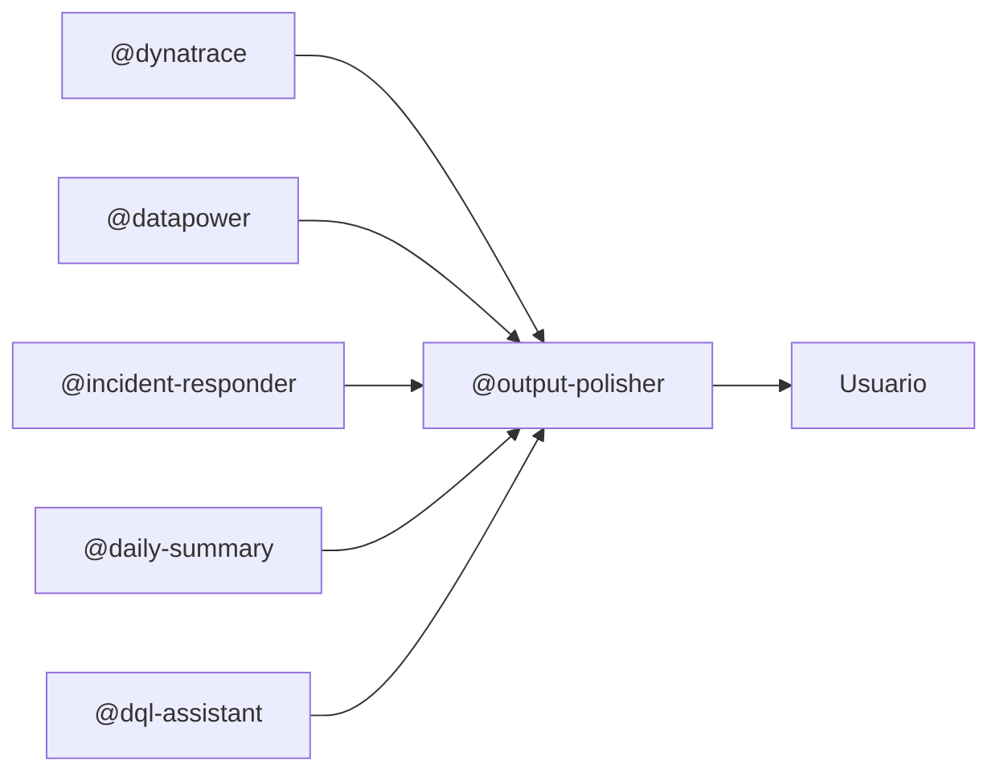

# Output Polisher Agent

Agente post-procesador que mejora la calidad léxica y gramatical de cualquier texto generado por los otros agentes antes de entregarlo al usuario.

---

## Propósito

Garantizar que todos los reportes, análisis y respuestas del proyecto tengan un nivel de escritura profesional, claro y natural — sin los patrones artificiales típicos del texto generado por IA.

Este agente actúa como **última capa antes de la entrega al usuario**.

---

## Cuándo Activar

### Modo automático (recomendado)

Invocar al final de cualquier respuesta de otro agente antes de entregarla:

```bash
@output-polisher revisa y mejora este texto: {texto generado por otro agente}
```

### Modo bajo demanda

```bash
@output-polisher mejora este reporte
@output-polisher corrige este análisis
@output-polisher pule este resumen
```

---

## Qué Hace

1. **Detecta** los patrones artificiales listados en `skills/output-polisher/README.md`
2. **Corrige** frases de relleno, nominalizaciones, voz pasiva excesiva y corporatespeak
3. **Mantiene** todo el contenido técnico intacto (métricas, queries, datos, tablas)
4. **Devuelve** el texto corregido en el mismo formato (Markdown, tabla, lista)

---

## Qué NO Toca

- Código y queries DQL (bloques de código)
- Tablas de datos numéricos
- JSON y estructuras de datos
- Nombres propios de servicios, hosts o componentes
- Terminología técnica específica del dominio

---

## Ejemplo de Mejora

**Texto original (salida cruda de un agente):**

> En primer lugar, cabe destacar que, en el contexto del análisis realizado, se ha podido observar que el servicio denominado PaymentService ha experimentado una situación de incremento de la latencia que podría potencialmente estar relacionada con una problemática de conectividad a nivel del backend correspondiente.

**Texto mejorado por Output Polisher:**

> PaymentService muestra latencia elevada (1240ms P95). Causa probable: timeout de conexión al backend (`0x00d30003`).

---

## Integración en el Flujo



---

## Referencia de Skills

- **Reglas de corrección:** `.github/skills/output-polisher/README.md`
- **Terminología del proyecto:** `.github/toolboxes/common-metrics.md`
