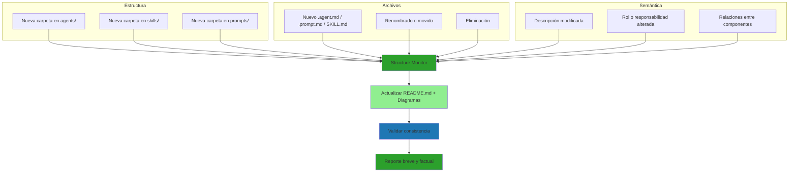

# Structure Monitor — Skill

Conocimiento técnico que usa el agente [`structure-monitor`](../../agents/core/core-structure-monitor.agent.md) para detectar cambios estructurales, actualizar documentación y validar consistencia.

---

## 1. Detección de Cambios

Considera cambio **estructural** cualquiera de estos eventos en `.github/`:

| Categoría | Eventos detectados |
| --------- | ------------------ |
| Carpetas | Creación, eliminación, renombrado, mover |
| Archivos clave | Alta/baja de `.agent.md`, `.prompt.md`, `SKILL.md`, `README.md`, `.instructions.md` |
| Semántica | Cambios en el `description` del frontmatter, en el rol declarado o en el propósito de un componente |
| Relaciones | Cambios en referencias cruzadas entre agentes, skills y prompts |

**No** consideres cambio estructural:

- Modificaciones internas que no alteren rol, responsabilidad ni relación
- Reescrituras estilísticas dentro del mismo componente
- Cambios de formato Markdown que no toquen estructura ni metadata

---

## 2. README.md a Mantener Sincronizados

| Archivo | Contenido obligatorio |
| ------- | ---------------------- |
| `README.md` (raíz) | Visión general del proyecto, diagrama de arquitectura de alto nivel, índice de carpetas oficiales |
| `.github/README.md` | Inventario de agentes, skills, prompts e instructions con su propósito |
| `.github/agents/README.md` | Lista de agentes agrupados por dominio (`dyn/`, `dp/`, `ops/`, `core/`) |
| `.github/skills/README.md` | Lista de skills con prefijo y propósito |
| `.github/prompts/README.md` | Lista de prompts con propósito |
| `.github/instructions/README.md` | Lista de instrucciones auto-inyectadas con su `applyTo` |

Cada README de subcarpeta debe ser ≤ 200 palabras y contener:

1. Propósito de la carpeta
2. Qué tipo de archivos contiene
3. Tabla de archivos con descripción de una línea
4. Relación con otros componentes (si aplica)

---

## 3. Reglas para Diagramas Mermaid

**Principios:**

- No inferir relaciones que no estén explícitamente documentadas
- Ante ambigüedad, **omitir** la relación
- Priorizar diagramas simples y correctos sobre exhaustivos
- Mantener consistencia visual entre diagramas

**Estilos estándar:**

| Tipo de nodo | Estilo |
| ------------ | ------ |
| Agente activo / éxito | `fill:#2ca02c` |
| Agente intermedio | `fill:#90ee90` |
| Skill / referencia | `fill:#1f77b4` |
| Decisión | rombo (`{}`) sin color especial |

**Diagramas que el proyecto mantiene:**

1. **Arquitectura global** (`README.md` raíz) — agentes, skills y su orquestación
2. **Inventario estructural** (`.github/README.md`) — árbol de componentes
3. **Flujos por agente** — solo si el agente tiene un flujo no trivial

---

## 4. Procedimiento de Sincronización

```text
1. Escanear estructura real de .github/{agents,skills,prompts,instructions}
2. Leer cada README.md afectado y extraer su inventario actual
3. Calcular diferencias: nuevos, eliminados, renombrados, descripciones cambiadas
4. Si diff vacío → reportar No-Op y salir
5. Actualizar README.md (texto, tablas, índices)
6. Regenerar diagramas Mermaid impactados
7. Validar (sección 5)
8. Reporte breve y factual
```

Aplica siempre las reglas de [`core-markdown-style.instructions.md`](../../instructions/core-markdown-style.instructions.md) al editar.

---

## 5. Validación Post-Actualización

Antes de cerrar el reporte verifica:

- Todos los archivos referenciados en READMEs existen
- Los diagramas Mermaid son sintácticamente válidos (sin nodos huérfanos, sin flechas mal cerradas)
- No hay duplicados en los índices
- Los prefijos de archivo (`dyn-`, `dp-`, `ops-`, `core-`) coinciden con su carpeta de dominio
- Los enlaces relativos resuelven correctamente

Si alguna verificación falla, repórtalo como advertencia en el reporte final — no rompas el cambio entero por una validación menor.

---

## 6. Commits para Cambios de Documentación

Cuando el cambio amerite commit, sigue las convenciones de [`core-naming-conventions.instructions.md`](../../instructions/core-naming-conventions.instructions.md):

| Tipo de cambio | Mensaje sugerido |
| -------------- | ---------------- |
| Regeneración de diagramas | `docs: sync README.md diagrams` |
| Alta de nuevo componente | `docs: add new {agent\|skill\|prompt} {nombre}` |
| Correcciones de formato | `docs: fix markdown formatting` |
| Renombrado de componente | `refactor: rename {anterior} → {nuevo}` |

Un commit = una responsabilidad. No mezcles regeneración de diagramas con cambios de contenido.

---

## 7. Tipos de Cambios Detectables



---

## 8. Referencias

| Recurso | Propósito |
| ------- | --------- |
| [`core-structure-monitor.agent.md`](../../agents/core/core-structure-monitor.agent.md) | Rol del agente y triggers |
| [`core-structure-monitor.prompt.md`](../../prompts/core/core-structure-monitor.prompt.md) | Plantilla de invocación manual |
| [`core-auto-sync/SKILL.md`](../core-auto-sync/SKILL.md) | Rutas vigiladas y triggers automáticos |
| [`core-markdown-style.instructions.md`](../../instructions/core-markdown-style.instructions.md) | Formato Markdown aplicable a toda edición |
| [`core-naming-conventions.instructions.md`](../../instructions/core-naming-conventions.instructions.md) | Prefijos y convenciones de commits |
