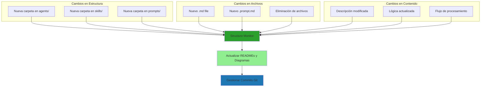

# Structure Monitor Skill

Skill que implementa la lógica de detección de cambios y sincronización de documentación.

## 🛠️ Funciones Principales

### 1. `detectChanges()`

Detecta cambios en:

- Nuevas carpetas creadas
- Nuevas carpetas eliminadas
- Nuevos archivos agregados
- Cambios en nombres
- Cambios en jerarquía

### 2. `updateReadmes(changeSet)`

Actualiza automáticamente los README.md afectados con:

- Diagramas Mermaid sincronizados
- Descripción de nuevos componentes
- Referencias cruzadas actualizadas
- Listados de archivos actualizados

### 3. `syncDiagrams()`

Sincroniza todos los diagramas Mermaid para que reflejen:

- Estructura actual de carpetas
- Relaciones entre componentes
- Flujo de procesamiento actualizado
- Dependencias entre agentes

### 4. `validateConsistency()`

Valida que la documentación sea consistente:

- Verifica que todos los README.md existan
- Comprueba que los diagramas Mermaid sean válidos
- Asegura que todas las referencias sean correctas
- Valida que la documentación refleje la estructura actual
- Verifica el formato Markdown de los archivos `.md`, incluyendo la regla de saltos de línea después de encabezados

### 5. `manageGitCommits()`

Gestionar automáticamente commits Git después de cambios en documentación:

- Crear commits con mensajes descriptivos siguiendo convenciones
- Hacer push automático a rama principal
- Integrar con GitHub CLI para operaciones avanzadas
- Mantener historial limpio de cambios de documentación

## 📊 Tipos de Cambios Detectables

## 🔌 Integración con el Proyecto

El skill funciona en conjunto con:

- **Prompt**: `.github/prompts/core/core-structure-monitor.prompt.md`
- **Agent**: `.github/agents/core/core-structure-monitor/`
- **Config**: `.github/customizations/auto-sync.md`

## ⚡ Rendimiento

- Ejecución: Automática después de cada cambio
- Tiempo de detección: Instantáneo
- Actualización de diagramas: < 2 segundos
- Validación: < 1 segundo
