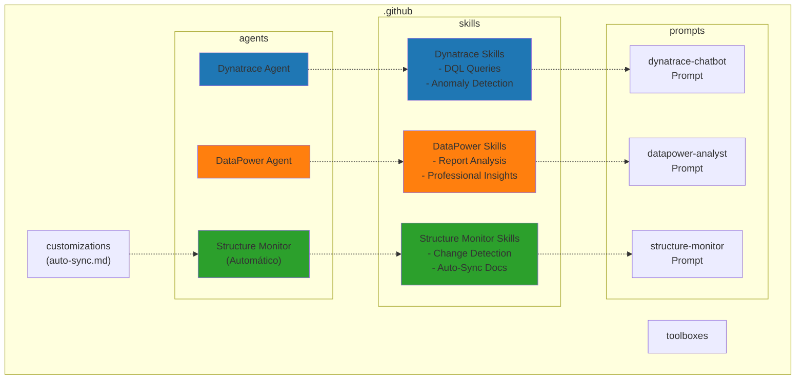
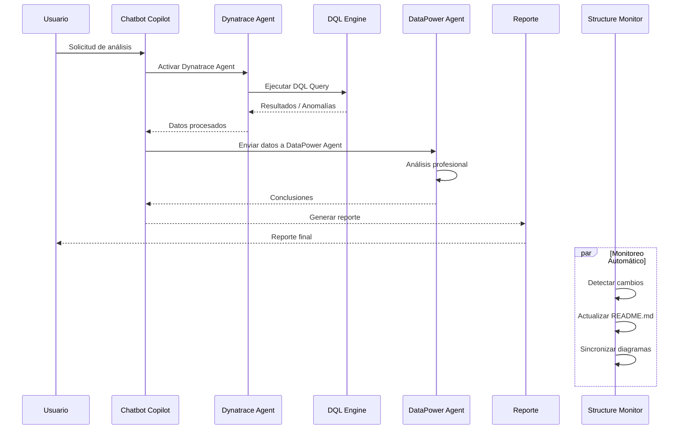

# ai-carib-intelligence-agent

Estructura inicial creada para soportar GitHub Copilot con carpetas de skills, agents y prompts.

## 📊 Estructura del Proyecto



## 🔄 Flujo de Procesamiento



## 📁 Estructura de Carpetas

```bash
ai-carib-intelligence-agent/
├── README.md (este archivo)
└── .github/
    ├── README.md (documentación de estructura)
    ├── agents/
    │   ├── dynatrace/
    │   │   └── README.md
    │   ├── datapower/
    │   │   └── README.md
    │   └── structure-monitor/
    │       └── README.md
    ├── skills/
    │   ├── dynatrace/
    │   │   └── README.md
    │   ├── datapower/
    │   │   └── README.md
    │   └── structure-monitor/
    │       └── README.md
    ├── prompts/
    │   ├── dynatrace-chatbot.prompt.md
    │   ├── datapower-analyst.prompt.md
    │   └── structure-monitor.prompt.md
    ├── customizations/
    │   ├── README.md
    │   └── auto-sync.md
    └── toolboxes/
        └── README.md
```

## 🎯 Componentes Principales

### 1. **Dynatrace Agent** 🔵

- Conexión con Davis IA de Dynatrace
- Ejecución de consultas DQL
- Detección de anomalías
- Extracción de métricas y logs

### 2. **DataPower Agent** 🟠

- Análisis profesional de reportes
- Generación de insights
- Recomendaciones basadas en datos
- Componente independiente sin dependencias externas

### 3. **Chatbot Copilot** 💬

- Coordinador central
- Orquesta el flujo entre agentes
- Genera reportes finales

### 4. **Structure Monitor** 🟢

- Detecta cambios automáticamente
- Sincroniza documentación
- Actualiza diagramas Mermaid
- Funciona sin intervención manual

## 🤖 Agente Structure Monitor

Un agente especial que **automáticamente**:

- Detecta cambios en la estructura del proyecto
- Actualiza todos los README.md necesarios
- Regenera diagramas Mermaid
- Sincroniza referencias cruzadas
- Valida consistencia de documentación

**No requiere activación manual** - funciona transparentemente en segundo plano.

Detalles en: [.github/prompts/structure-monitor.prompt.md](.github/prompts/structure-monitor.prompt.md)

## ✅ Estado Actual

- ✓ Estructura de carpetas creada
- ✓ Agentes separados (Dynatrace y DataPower)
- ✓ Agente Structure Monitor implementado
- ✓ Prompts inicializados
- ✓ Skills organizados por dominio
- ✓ Auto-sincronización de documentación configurada
- ✓ Espacio para customizaciones y toolboxes
- ⏳ Implementación de conexiones específicas
- ⏳ Scripts de integración
- ⏳ Tests automatizados
