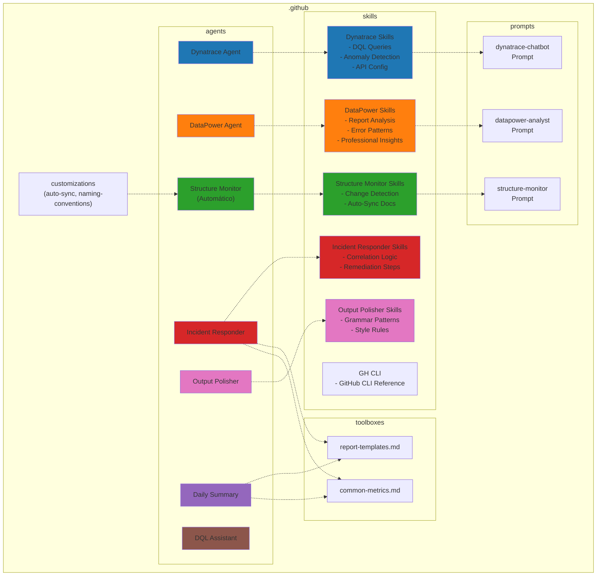
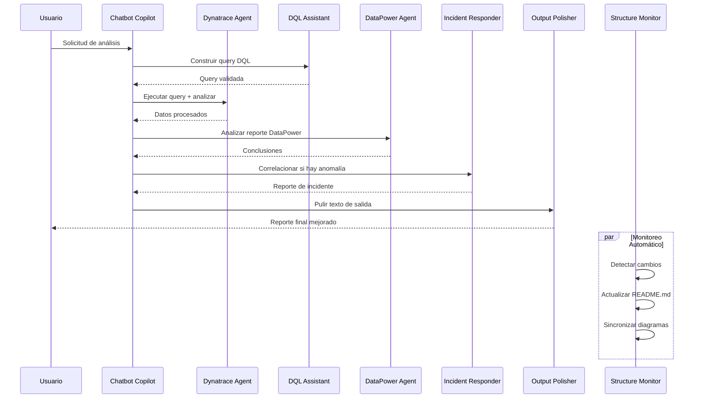

# ai-carib-intelligence-agent

Plataforma de inteligencia para análisis de Dynatrace y DataPower, construida sobre GitHub Copilot con agentes especializados, skills y prompts.

## 📊 Estructura del Proyecto



## 🔄 Flujo de Procesamiento



## 📁 Estructura de Carpetas

```text
ai-carib-intelligence-agent/
├── README.md
├── CLAUDE.md                        ← Guía para Claude Code
├── Comandos.md                      ← Referencia de comandos Copilot
└── .github/
    ├── copilot-instructions.md
    ├── README.md
    ├── agents/
    │   ├── dyn/
    │   │   ├── dyn-analyst.agent.md             ← Análisis DQL, métricas y anomalías
    │   │   └── dyn-dql-assistant.agent.md       ← Constructor y validador de queries DQL
    │   ├── dp/
    │   │   └── dp-analyst.agent.md              ← Análisis de reportes gateway
    │   ├── ops/
    │   │   ├── ops-incident-responder.agent.md  ← Respuesta a incidentes (dyn + dp)
    │   │   └── ops-daily-summary.agent.md       ← Resumen diario de métricas
    │   └── core/
    │       ├── core-structure-monitor.agent.md  ← Sincronización automática de docs
    │       ├── core-output-polisher.agent.md    ← Mejora léxica y gramatical
    │       ├── core-ai-team-dev.agent.md
    │       └── core-atlassian-jira.agent.md
    ├── skills/
    │   ├── dyn-queries/SKILL.md             ← Biblioteca DQL, API config, patrones
    │   ├── dp-analysis/SKILL.md             ← Patrones de análisis, códigos de error
    │   ├── ops-incident/SKILL.md            ← Correlación y pasos de remediación
    │   ├── ops-report-templates/SKILL.md    ← Plantillas de reportes compartidas
    │   ├── ops-metrics-thresholds/SKILL.md  ← SLO/SLA, umbrales y glosario
    │   ├── core-structure-monitor/SKILL.md  ← Lógica de detección y sincronización
    │   ├── core-output-polisher/SKILL.md    ← Reglas de estilo y patrones de mejora
    │   ├── core-gh-cli/SKILL.md             ← Referencia completa GitHub CLI
    │   ├── core-auto-sync/SKILL.md          ← Config de auto-sincronización
    │   └── core-naming-conventions/SKILL.md ← Convenciones y reglas de formato
    ├── prompts/
    │   ├── dyn/
    │   │   └── dyn-chatbot.prompt.md
    │   ├── dp/
    │   │   └── dp-analyst.prompt.md
    │   └── core/
    │       └── core-structure-monitor.prompt.md
    └── instructions/
        ├── core-naming-conventions.instructions.md ← Prefijos y commits (auto)
        └── core-markdown-style.instructions.md     ← Formato Markdown (auto)
```

## 🎯 Componentes Principales

### 1. **Dynatrace Agent** 🔵

- Conexión con Davis IA de Dynatrace
- Ejecución de consultas DQL
- Detección de anomalías y problemas activos
- Extracción de métricas, logs y trazas

### 2. **DataPower Agent** 🟠

- Análisis profesional de reportes de gateway
- Identificación de patrones de error (6 códigos documentados)
- Recomendaciones basadas en datos
- Componente completamente independiente de Dynatrace

### 3. **Chatbot Copilot** 💬

- Coordinador central de todos los agentes
- Orquesta el flujo entre Dynatrace, DataPower e Incident Responder
- Genera reportes finales usando plantillas estándar

### 4. 🤖 **Structure Monitor** 🟢

- Detecta cambios en la estructura del proyecto automáticamente
- Actualiza todos los README.md necesarios
- Regenera diagramas Mermaid
- Sincroniza referencias cruzadas
- Gestiona commits Git automáticos y push
- Valida consistencia de documentación

**No requiere activación manual** - funciona transparentemente en segundo plano.

### 5. **Incident Responder** 🔴

- Se activa ante anomalías críticas
- Correlaciona datos de Dynatrace y DataPower en el mismo servicio
- Genera reporte de incidente estructurado en minutos

### 6. **Daily Summary** 🟣

- Resumen automático diario del estado de los sistemas
- Compara métricas con el día anterior
- Identifica top 3 servicios degradados

### 7. **DQL Assistant** 🟤

- Especialista en construir y validar queries DQL
- Traduce preguntas en español a DQL ejecutable
- Separado del Dynatrace Agent (principio de responsabilidad única)

### 8. **Output Polisher** 🩷

- Post-procesador de todas las salidas de agentes
- Corrige patrones artificiales de IA en español
- Mejora léxico, gramática y estilo profesional
- Actúa como última capa antes de entregar al usuario

## ✅ Estado Actual

- ✓ Estructura de carpetas completa
- ✓ 8 agentes implementados y documentados
- ✓ Skills de Dynatrace y DataPower con contenido real
- ✓ Prompts de Dynatrace y DataPower implementados
- ✓ Toolboxes: plantillas de reportes y métricas comunes
- ✓ Auto-sincronización de documentación configurada
- ✓ Convenciones de nombres y formato Markdown definidas
- ✓ Output Polisher para mejora de calidad de escritura
- ⏳ Conexión real con API de Dynatrace
- ⏳ Conexión real con DataPower REST Management Interface
- ⏳ Chatbot orquestador principal
- ⏳ Tests automatizados
