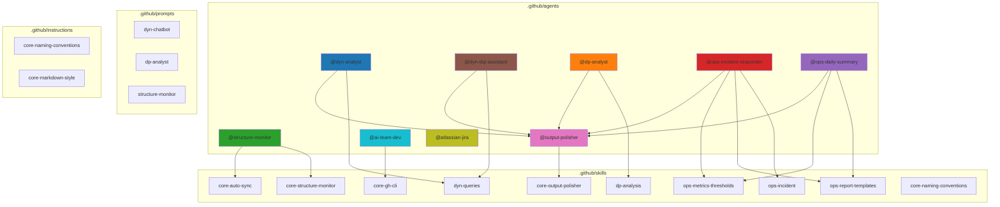
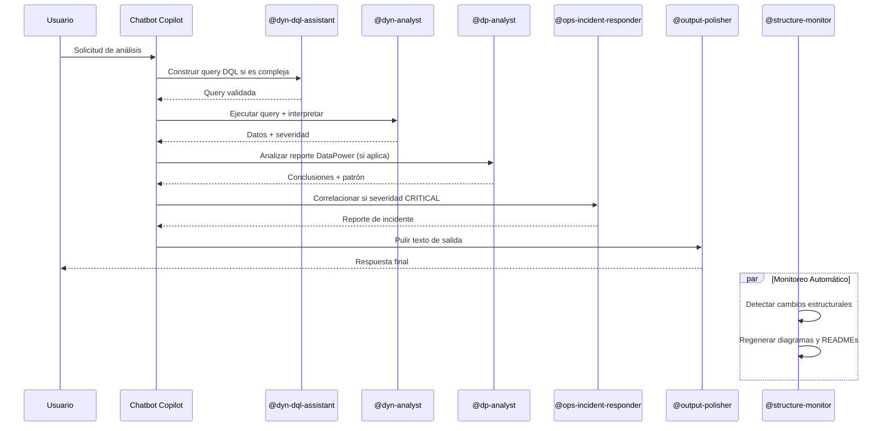

# ai-carib-intelligence-agent

Plataforma de inteligencia para análisis de Dynatrace y DataPower, construida sobre GitHub Copilot con agentes especializados, skills y prompts.

## Estructura del Proyecto



## Flujo de Procesamiento



## Estructura de Carpetas

```text
ai-carib-intelligence-agent/
├── README.md
├── CLAUDE.md                        ← Guía para Claude Code
├── Comandos.md                      ← Referencia de comandos Copilot
└── .github/
    ├── copilot-instructions.md
    ├── README.md
    ├── agents/
    │   ├── dyn/
    │   │   ├── dyn-analyst.agent.md             ← Análisis DQL, métricas y anomalías
    │   │   └── dyn-dql-assistant.agent.md       ← Constructor y validador de queries DQL
    │   ├── dp/
    │   │   └── dp-analyst.agent.md              ← Análisis de reportes gateway
    │   ├── ops/
    │   │   ├── ops-incident-responder.agent.md  ← Respuesta a incidentes (dyn + dp)
    │   │   └── ops-daily-summary.agent.md       ← Resumen diario de métricas
    │   └── core/
    │       ├── core-structure-monitor.agent.md  ← Sincronización automática de docs
    │       ├── core-output-polisher.agent.md    ← Mejora léxica y gramatical
    │       ├── core-ai-team-dev.agent.md        ← Equipo Nova/Sage/Milo para implementación
    │       └── core-atlassian-jira.agent.md     ← Requisitos → Jira épicas + historias
    ├── skills/
    │   ├── dyn-queries/SKILL.md             ← Biblioteca DQL, API config, patrones
    │   ├── dp-analysis/SKILL.md             ← Patrones de análisis, códigos de error
    │   ├── ops-incident/SKILL.md            ← Correlación y pasos de remediación
    │   ├── ops-report-templates/SKILL.md    ← Plantillas de reportes compartidas
    │   ├── ops-metrics-thresholds/SKILL.md  ← SLO/SLA, umbrales y glosario
    │   ├── core-structure-monitor/SKILL.md  ← Lógica de detección y sincronización
    │   ├── core-auto-sync/SKILL.md          ← Configuración de triggers automáticos
    │   ├── core-output-polisher/SKILL.md    ← Patrones de mejora léxica
    │   ├── core-gh-cli/SKILL.md             ← Referencia completa GitHub CLI
    │   └── core-naming-conventions/SKILL.md ← Criterios de decisión para nombres
    ├── prompts/
    │   ├── dyn/
    │   │   └── dyn-chatbot.prompt.md
    │   ├── dp/
    │   │   └── dp-analyst.prompt.md
    │   └── core/
    │       └── core-structure-monitor.prompt.md
    └── instructions/
        ├── core-naming-conventions.instructions.md ← Prefijos y commits (auto)
        └── core-markdown-style.instructions.md     ← Formato Markdown (auto)
```

## Componentes Principales

### Agentes operativos

| Agente | Invocación | Propósito |
| ------ | ---------- | --------- |
| Dynatrace Analyst | `@dyn-analyst` | Construye DQL, ejecuta queries, interpreta métricas y anomalías |
| DQL Assistant | `@dyn-dql-assistant` | Especialista único en construir/validar/optimizar queries DQL |
| DataPower Analyst | `@dp-analyst` | Analiza reportes del gateway, clasifica severidad, recomienda acciones |
| Incident Responder | `@ops-incident-responder` | Correlaciona anomalías Dynatrace ↔ DataPower y produce reporte de incidente |
| Daily Summary | `@ops-daily-summary` | Resumen diario automático con tendencias y top servicios degradados |

### Agentes de infraestructura

| Agente | Invocación | Propósito |
| ------ | ---------- | --------- |
| Structure Monitor | `@structure-monitor` | Mantiene README.md y diagramas Mermaid sincronizados con la estructura real |
| Output Polisher | `@output-polisher` | Última capa de pulido léxico antes de entregar al usuario |
| AI Team Dev | `@ai-team-dev` | Equipo Nova (frontend) + Sage (backend) + Milo (visual) para implementación |
| Atlassian Jira | `@atlassian-jira` | Convierte documentos de requisitos en épicas e historias de usuario en Jira |

### Skills

- **Dominio:** `dyn-queries`, `dp-analysis`
- **Cross-domain:** `ops-incident`, `ops-report-templates`, `ops-metrics-thresholds`
- **Infraestructura:** `core-structure-monitor`, `core-auto-sync`, `core-output-polisher`, `core-gh-cli`, `core-naming-conventions`

## Estado Actual

- ✓ 9 agentes definidos con frontmatter consistente
- ✓ 10 skills con conocimiento técnico estructurado
- ✓ 3 prompts reutilizables para invocaciones específicas
- ✓ 2 instructions auto-inyectadas (naming conventions + markdown style)
- ✓ Output Polisher como última capa de pulido lingüístico
- ✓ Structure Monitor mantiene la documentación sincronizada
- ⏳ Conexión real con API de Dynatrace
- ⏳ Conexión real con DataPower REST Management Interface
- ⏳ Chatbot orquestador principal
- ⏳ Tests automatizados

## Sincronización Manual

Para forzar una pasada del Structure Monitor:

```text
Sincroniza la documentación con los cambios actuales
```

O ejecutar `/structure-monitor-sync` desde Copilot.
